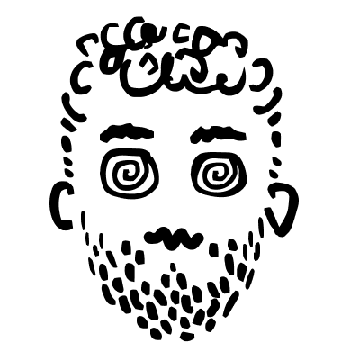

# about

- Currently at [Our World in Data](https://ourworldindata.org).
- Previously: [eDreams ODIGEO](https://www.edreamsodigeo.com/), [NII](https://www.nii.ac.jp/en/), [Tracy](https://www.linkedin.com/company/tracy).
- Telecom/Electrical Engineer. Studied at [KTH](https://www.kth.se), [UPC](https://www.upc.edu/en), [KIT](https://www.kit.edu/english).   

[> download cv](/files/CV_1p.pdf)  
[> more about me](/pages/misc)  
[> blog](http://medium.com/@lucasrg)

<!--  -->
