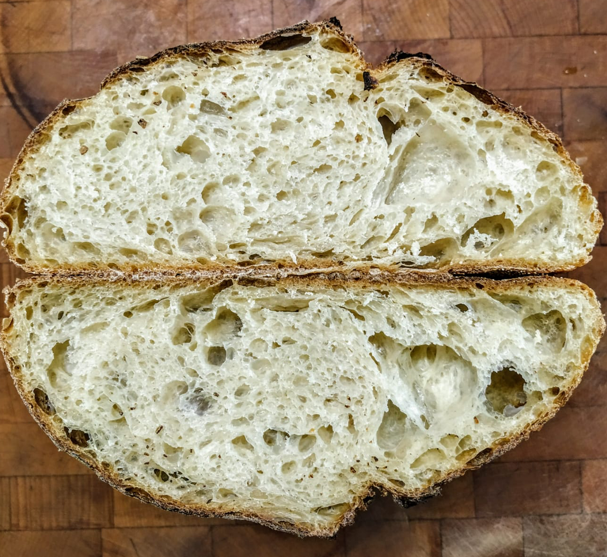

<a href="{{ site.baseurl }}/index.html" class="back2"><i class="fa fa-home" aria-hidden="true"></i></a> &nbsp;&nbsp; 
[news]({{ site.baseurl }}/pages/news.html) &nbsp;&nbsp; [projects]({{ site.baseurl }}/pages/projects.html) &nbsp;&nbsp; [research]({{ site.baseurl }}/pages/research.html) &nbsp;&nbsp;
[cv]({{ site.baseurl }}/pages/cv.html) &nbsp;&nbsp; [blog](https://medium.com/@lucasrg) &nbsp;&nbsp; [misc]({{ site.baseurl }}/pages//misc.html) &nbsp;&nbsp;
[contact]({{ site.baseurl }}/pages/contact.html)  
# miscellaneous
People tell me that there is other things beyond coding and calculus. That is something I try not to forget by enjoying other hobbies.

##### Music
I used to produce music for fun and DJ in some places. I still have an equipment and enjoy using it whenever I have
time. 

Dancing at 120 BPM is one of things I enjoy the most. 

Playing the ukulele is another way I have found of expressing myself.

[*> soundcloud*](https://soundcloud.com/lilkadel)
##### Food
I love cooking. Rices, home made pasta and fresh veggetables are probably my favourites.

I started the **Pan Ribas** project with my brother, an initiative to share visuals on our shared passion: baking bread.

[*> Instagram*](https://instagram.com/panribas)  

<a href="http://linkedin.com/in/lucasrodes"><i class='fa fa-linkedin'></i></a>&nbsp;&nbsp;
<a href="http://twitter.com/lucasrodesg"><i class='fa fa-twitter'></i></a>&nbsp;&nbsp;
<a href="http://github.com/lucasrodes"><i class='fa fa-github'></i></a>&nbsp;&nbsp;
<a href="https://scholar.google.es/citations?user=5KPcE6QAAAAJ&hl=en"><i class='fa fa-google'></i></a>
